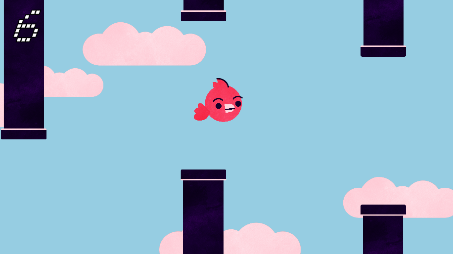

# Flappy Bird
A clone of popular mobile game "Flappy Bird" developed in C# using the Unity game engine.

Based on the design featured in GMTK's [The Unity Tutorial For Complete Beginners](https://www.youtube.com/watch?v=XtQMytORBmM), with additional enhancements:
* Scrolling cloud background graphics
* Implemented Unity's updated TextMeshPro text renderer
* Animated bird sprite